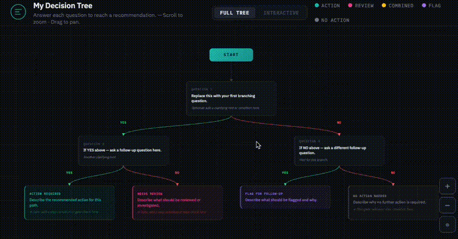

# Treage (trē-ˌäzh )
>(it's "triage" but with a tree in it )

**[→ Live Demo](https://rseldner.github.io/treage/)**

A lightweight framework for building interactive decision trees.
Just a JS file (local or from cdn), your config/html, and a browser.



---

## How it works

You write two things into the html file: 
- a `CONFIG` object (colors, fonts, outcome types) 
- a `TREE` object (your actual questions and outcomes). 

The engine handles everything else (layout, rendering, zoom/pan, light/dark theme toggle)

Both views are driven by the same data:

- **Full Tree view** - zoomable/pannable D3 diagram of the whole tree. Good for reviewing the full logic.
- **Interactive view** - a one-question-at-a-time flow with breadcrumb navigation, progress indicators, and a styled outcome card at the end. Good for actually stepping through the workflow.

---

## Getting started

Grab one of the examples as a starting point:

- [examples/starter.html](examples/starter.html) ([live demo](https://rseldner.github.io/treage/examples/starter.html))      - minimal working tree to get started
- [examples/boilerplate.html](examples/boilerplate.html) ([live demo](https://rseldner.github.io/treage/examples/boilerplate.html)  - example with every feature documented with comments


If jsdelivr cdn is accessible, nothing else is needed.  The engine is already defined in the examples...

```html
<!DOCTYPE html>
<html lang="en">
<head>
  <meta charset="UTF-8">
  <title>My Tree</title>
  <script src="https://cdnjs.cloudflare.com/ajax/libs/d3/7.8.5/d3.min.js"></script>
  <script>
    const CONFIG = { ... };
    const TREE   = { ... };
  </script>
  <script src="https://cdn.jsdelivr.net/gh/rseldner/treage@1.2.0/treage.js"></script>
</head>
<body></body>
</html>
```

Otherwise, if using a local copy, swap the CDN line for a local copy if you prefer:

```html
<script src="treage.js"></script>
```


Then start customizing the `CONFIG` and `TREE` objects


---

## CONFIG

Controls the appearance and outcome types for your tree.

```js
const CONFIG = {
  title:        "My Decision Tree",
  subtitle:     "A short description.",
  icon:         `<svg .../>`,   // SVG string, or "" to omit

  palette:      { ... },        // dark theme colors
  paletteLight: { ... },        // light theme colors
  fonts:        { ... },        // body and mono font stacks
  nodeTypes:    { ... },        // outcome categories
};
```

### Palette 

Both `palette` and `paletteLight` use the same keys:

| Key | Controls |
|---|---|
| `bg` | Page / canvas background |
| `surface` | Card and control backgrounds |
| `border` | Default border color |
| `text` | Primary text |
| `muted` | Secondary text |
| `dim` | Eyebrow labels, placeholders |
| `accent` | Brand color - hover states, active toggle, progress dots |
| `edgeYes` | YES edges and YES buttons |
| `edgeNo` | NO edges and NO buttons |
| `edgeDefault` | Unlabelled or custom-label edges |
| `gridLine` | Background grid line color |
| `headerBg` | Header and footer background |

### Node types

Two keys are reserved (don't rename them):

- **`start`** - the root node. One per tree.
- **`question`** - all branching nodes. Used automatically.

Everything else is an outcome type. The framework includes five:

| Key | Color | Use for |
|---|---|---|
| `action` | Teal | Positive "go do this" paths |
| `review` | Pink | Needs investigation |
| `combined` | Yellow | Two things both apply |
| `flag` | Purple | Known issues, flagged items |
| `stop` | Grey | No action needed |

Add, remove, or rename outcome types freely. Each one needs `label`, `legendLabel`, `accent`, and `dark` / `light` sub-objects with the card styles. See `examples/boilerplate.html` for the full shape.

---

## TREE

The actual content. Two fields are worth knowing upfront.  everything else is in the examples.

```js
{
  id:        "q1",          // unique string, no spaces
  type:      "question",    // "question" or any key from CONFIG.nodeTypes
  eyebrow:   "Question 1",  // small label above the title
  isNew:     true,          // optional - yellow NEW badge
  title:     "The question or outcome text.",
  hint:      "Optional italic subtext or gate condition.",
  edgeLabel: "YES",         // label on the edge from parent to this node
  children:  [ ... ]        // nested children; omit or [] for outcomes
}
```

Edge labels:

| Value | Renders as |
|---|---|
| `"YES"` | Green edge + green button |
| `"NO"` | Red edge + red button |
| Any other string | Grey edge + plain button |
| `""` or omitted | No label (use on the root question) |

Non-binary branching works fine - give a question three or four children with labels like `"LOW"`, `"MED"`, `"HIGH"` and both views handle it automatically.

---

## Upgrading

The split between engine and config means upgrading is just a file swap:

- if using a local `treage.js` file, simply swap it with the newer version.
- if using tagged version on jsDelivr, simply update the version tag.

---

## Repo structure

```
treage/
├── index.html              live demo (Should I Deploy on Friday?)
├── treage.js               the engine
├── examples/               example decision tree repo
│   ├── starter.html        minimal starting point
│   └── boilerplate.html    full feature reference with comments
├── playground/
│   ├── playground.html     live Treage editor
│   └── playground.png      Treage Playground  screenshot
│   └── README.md    
├── tree.gif                Treage demo screenshot
├── README.md
├── CREDITS.md
└── LICENSE
```

---

## Requirements

Any modern browser. Internet access to load IBM Plex fonts from Google Fonts and D3 from cdnjs. For offline use, download both and point the tags at local copies.

---

## License

MIT - see `LICENSE`.
