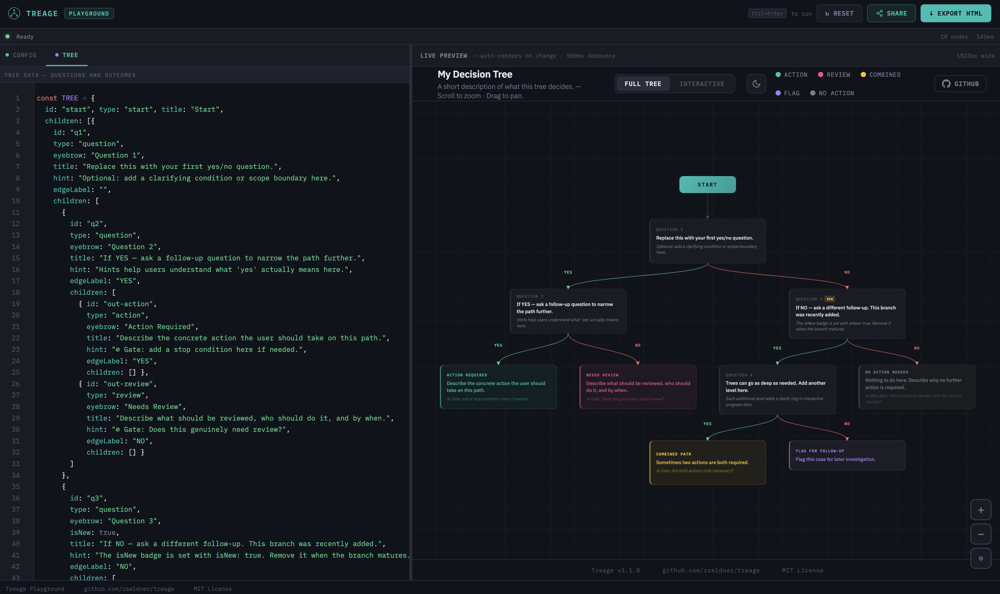

# Treage Playground

A browser-based editor for building and previewing Treage decision trees.

Open `playground.html` in a browser or access the [Live DEMO](https://rseldner.github.io/treage/playground/playground.html) and start editing.

The playground gives you a split-pane interface.

edit your `CONFIG` and `TREE` objects directly, and the tree re-renders automatically as you type.

It is a self-contained HTML. Everything runs locally in the browser.

---

## Interface

**Editor panel (left)**

Two tabs - `CONFIG` and `TREE` - each containing a CodeMirror editor with JavaScript syntax highlighting, line numbers, bracket matching, and fold gutters.

**Preview panel (right)**

A live iframe rendering the full Treage output, including both the tree view and interactive view. The preview re-renders 500ms after you stop typing.

**Status bar**

Shows render state (loading / ready / error), node count, and last render time.

**Error panel**

If your `CONFIG` or `TREE` contains a syntax error, a red panel appears below the editor with the parse error message. The preview does not update until the error is resolved.

---

## Controls

| Action | How |
|---|---|
| Render manually | `Ctrl+Enter` (or `Cmd+Enter` on Mac) |
| Reset to boilerplate eample | **↺ Reset** button |
| Export tree as standalone HTML | **↓ Export HTML** button |
| Share via URL | **Share** button - compresses current editor state into the URL hash |
| Resize editor/preview split | Drag the handle between the two panels |

---

## Shareable links

The **Share** button encodes your current `CONFIG` and `TREE` into the URL hash using LZ-String compression (yes, the URLs are HUGE. but hey it works). Anyone with the link can open the playground and see your exact tree.  Nothing is stored on any server.

The hash is re-generated each time you open the share bar.

A new hash is needed for every edit.

---

## Export

**↓ Export HTML** downloads a standalone `my-tree.html` file containing your `CONFIG`, `TREE`, and a CDN reference to `treage.js`. This file is a fully self-contained Treage consumer - the same pattern as `examples/boilerplate.html`. It can be opened directly in a browser or committed to a repo.

---

## Third-party dependencies

| Library | Version | License | Author |
|---|---|---|---|
| [CodeMirror](https://github.com/codemirror/codemirror5) | 5.65.19 | MIT | Marijn Haverbeke and others |
| [LZ-String](https://github.com/pieroxy/lz-string) | 1.5.0 | MIT | Pieroxy |

D3.js and IBM Plex (used in the preview iframe via treage.js) are credited in the root [CREDITS.md](../CREDITS.md).
